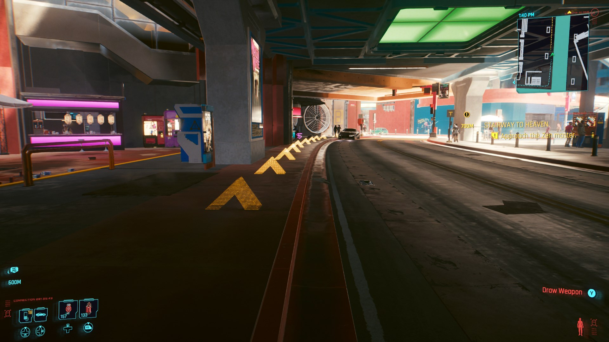

# In-World Navigation

This mod displays in-world holographic arrows for quest/point of interest navigation, mirroring the dots in the minimap. They're currently displayed all of the time, but will eventually be configurable.

## Installation

[Get the latest release here](https://github.com/jackhumbert/in_world_navigation/releases), or [grab the latest CI build here (developers only)](https://github.com/jackhumbert/in_world_navigation/actions). If you're upgrading, you may want to delete the `r6/scripts/in_world_navigation` folder, since files may have been renamed/removed.

## Requirements

* [RED4ext](https://github.com/WopsS/RED4ext)
* [Redscript](https://github.com/jac3km4/redscript)
* [Mod Settings](https://github.com/jackhumbert/mod_settings)

## Bugs

If you come across something that doesn't work quite right, or interferes with another mod, [search for or create an issue!](https://github.com/jackhumbert/in_world_navigation/issues) I have a lot of things on a private TODO list still, but can start to move things to Github issues.

Special thanks to @psiberx for [Codeware Lib](https://github.com/psiberx/cp2077-codeware/), [InkPlayground Demo](https://github.com/psiberx/cp2077-playground), and Redscript & CET examples on Discord, @WopsS for [RED4ext](https://github.com/WopsS/RED4ext), @jac3km4 for [Redscript toolkit](https://github.com/jac3km4/redscript), @yamashi for [CET](https://github.com/yamashi/CyberEngineTweaks) and the [E-mode mod](https://www.nexusmods.com/cyberpunk2077/mods/3207?tab=description) (very helpful in figuring out how to work with FMOD), @rfuzzo & team (especially @seberoth!) for [WolvenKit](https://github.com/WolvenKit/WolvenKit), and all of them for being helpful on Discord.
