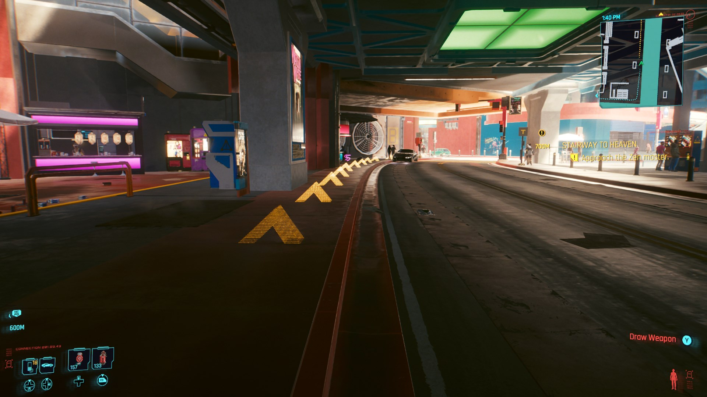

# In-World Navigation

This mod displays in-world holographic arrows for quest/point of interest navigation, mirroring the dots in the minimap.

## Settings

Everything lives in the "Mod Settings" menu (not "Mods"): show arrows, display mode (always / driving / walking), spacing, count, fade distance, and:

* **Toggle arrows key** (default `;`): flips "Show arrows" in-game. Needs [Input Loader](https://github.com/jackhumbert/cyberpunk2077-input-loader); without it the arrows can still be toggled from the settings page.
* **Follow HUD visibility** (default on): hides the arrows whenever the minimap is hidden, so they go away in photo mode and with HUD-hiding mods (Limited HUD, HUD toggles, AMM) without a dependency on any of them.

## Installation

[Get the latest release here](https://github.com/jackhumbert/in_world_navigation/releases), or [grab the latest CI build here (developers only)](https://github.com/jackhumbert/in_world_navigation/actions). If you're upgrading, you may want to delete the `r6/scripts/in_world_navigation` folder, since files may have been renamed/removed.

## Requirements

* [RED4ext](https://github.com/WopsS/RED4ext)
* [Redscript](https://github.com/jac3km4/redscript)
* [Mod Settings](https://github.com/jackhumbert/mod_settings)
* [Input Loader](https://github.com/jackhumbert/cyberpunk2077-input-loader) (optional, for the toggle key)

## Bugs

If you come across something that doesn't work quite right, or interferes with another mod, [search for or create an issue!](https://github.com/jackhumbert/in_world_navigation/issues) I have a lot of things on a private TODO list still, but can start to move things to Github issues.

Special thanks to @psiberx for [Codeware Lib](https://github.com/psiberx/cp2077-codeware/), [InkPlayground Demo](https://github.com/psiberx/cp2077-playground), and Redscript & CET examples on Discord, @WopsS for [RED4ext](https://github.com/WopsS/RED4ext), @jac3km4 for [Redscript toolkit](https://github.com/jac3km4/redscript), @yamashi for [CET](https://github.com/yamashi/CyberEngineTweaks) and the [E-mode mod](https://www.nexusmods.com/cyberpunk2077/mods/3207?tab=description) (very helpful in figuring out how to work with FMOD), @rfuzzo & team (especially @seberoth!) for [WolvenKit](https://github.com/WolvenKit/WolvenKit), and all of them for being helpful on Discord.
